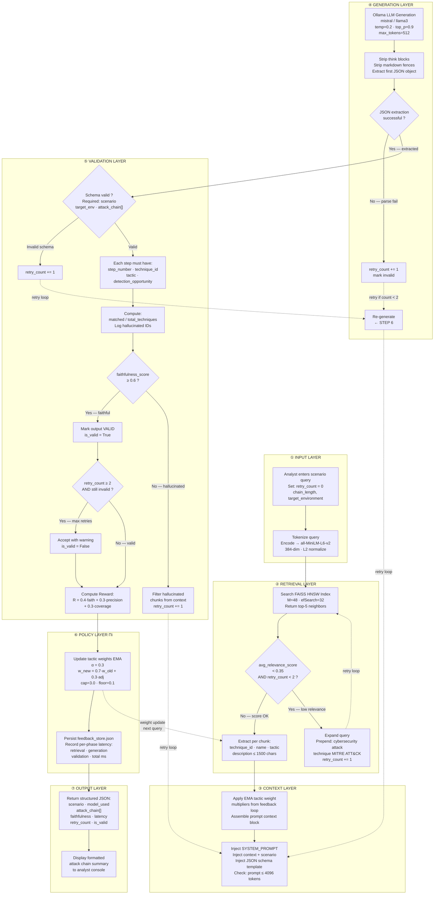

# Red ELISAR — Runtime Execution Flow

> Auto-generated on 2026-04-15 19:30:21
> Source: `diagram_generator.py`

## System: RAG-based Offensive Security Agent (Single Query Flow)

The diagram below shows the **complete step-by-step runtime execution** for
a single analyst query — from input through retrieval, generation, validation,
policy feedback, and final JSON output.

**Layers:**
1. Input — query tokenization & embedding
2. Retrieval — FAISS HNSW top-5 search with relevance gate
3. Context — chunk extraction + EMA weight application
4. Generation — Ollama LLM with JSON extraction
5. Validation — schema + faithfulness gating with retry loops
6. Policy (Πi) — reward computation + EMA tactic weight update
7. Output — structured JSON attack chain

---

---

**Key Parameters:**
| Parameter | Value |
|---|---|
| FAISS HNSW M | 48 |
| efSearch | 32 |
| top-k retrieval | 5 |
| Relevance threshold | 0.35 |
| Faithfulness threshold | 0.6 |
| Max retries | 2 |
| LLM temperature | 0.2 |
| LLM top_p | 0.9 |
| LLM max_tokens | 512 |
| EMA α | 0.3 |
| Weight floor / cap | 0.1 / 3.0 |
| Embedding dim | 384 |
| Chunk size (tokens) | 512 |
| Chunk overlap (tokens) | 128 |
